# Logigramme - Processus ETL WeatherHub

## Flux de Collecte, Transformation et Stockage des Données

prévisualisation => ctrl + Shift + P : Markdown: Open Preview to the Side

```mermaid
graph TD
    A[🚀 Démarrage du processus] --> B[🧹 Vider les collections MongoDB]
    B --> C[📂 Lister les fichiers CSV sur S3]
    C --> D{📄 Type de fichier ?}
    
    D -->|StationsMeteorologiques| E[🏭 Import Stations Standards]
    D -->|WeatherBE/FR| F[🌍 Import Stations Weather Underground]
    
    E --> G[📊 Traitement des données JSON]
    G --> H[🏢 Créer documents stations]
    H --> I[🌡️ Normaliser données hourly]
    I --> J[💾 Insérer en MongoDB - Collection weather]
    
    F --> K[🏗️ Créer station WeatherBE/FR]
    K --> L[🔧 Normaliser données BE/FR]
    L --> M[🔄 Conversion unités °F→°C, mph→km/h]
    M --> N[💾 Insérer en MongoDB - Collection weather]
    
    J --> O[📈 Mesure qualité des données]
    N --> O
    
    O --> P[📊 Analyse des précipitations]
    P --> Q[⏱️ Benchmarks de performance]
    Q --> R[✅ Processus terminé]
    
```



## 🔧 Détail des Transformations

### 1. **Collecte des Données**
- **Source** : AWS S3 (Bucket configuré)
- **Format** : CSV avec colonne `_airbyte_data` (JSON)
- **Types** : StationsMeteorologiques, WeatherBE, WeatherFR

### 2. **Transformation**
```python
# Normalisation WeatherBE/FR
°F → °C : (f - 32) × 5/9
mph → km/h : mph × 1.60934
in → mm : inches × 25.4
inHg → hPa : inhg × 33.8639
```

### 3. **Stockage MongoDB**
- **Base** : weatherhub
- **Collections** : stations, weather
- **Index** : station_id, dh_utc
- **Réplication** : Configurée via docker-compose

## 📋 Structure des Documents

### Collection `stations`
```json
{
  "_id": ObjectId,
  "id": "ILAMAD25",
  "name": "La Madeleine", 
  "latitude": 50.659,
  "longitude": 3.07,
  "type": "weather_underground",
  "source_file": "WeatherFR.csv",
  "created_at": ISODate
}
```

### Collection `weather`
```json
{
  "_id": ObjectId,
  "station_id": "ILAMAD25",
  "dh_utc": "2024-01-15 14:30:00",
  "measurements": {
    "temperature": {"value": 15.2, "unit": "degC"},
    "pressure": {"value": 1013.2, "unit": "hPa"},
    "precipitation": {"accumulation": {"value": 0.5, "unit": "mm"}}
  },
  "metadata": {
    "source_file": "WeatherFR.csv",
    "created_at": ISODate
  }
}
```
